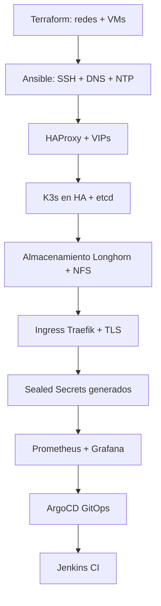

# 🔐 k3s-secrets-cluster

Automatización completa para instalar y configurar **Sealed Secrets** de Bitnami en un clúcster **K3s** usando **Ansible**. Esta herramienta permite gestionar secretos cifrados seguros dentro de Kubernetes, compatibles con flujos GitOps y control de versiones en Git.

---

## 📦 Características

* Instalación de **Sealed Secrets Controller** vía Helm.
* Plantillas de secretos (`Opaque`) para cifrado.
* Generación de manifiestos sellados con `kubeseal`.
* Reutilización de secretos en Jenkins, ArgoCD, Prometheus, Grafana, etc.
* Compatible con arquitectura HA de K3s.
* Preparado para CI/CD y uso con ArgoCD y GitHub.

---

## 🗂️ Estructura Recomendada

```
k3s-secrets-cluster/
├── group_vars/
│   └── all.yml
├── inventory/
│   └── hosts.ini
├── playbooks/
│   └── install_sealed_secrets.yml
├── roles/
│   ├── sealed_secrets/
│   │   └── tasks/main.yml
│   └── kubeseal_installer/
│       └── tasks/main.yml
├── templates/
│   └── secret-example.yaml.j2
└── README.md
```

---

## 🚀 Instalación del Controller y Kubeseal

Ejecutar:

```bash
ansible-playbook -i inventory/hosts.ini playbooks/install_sealed_secrets.yml
```

Esto instala el controlador en el clúcster y la herramienta `kubeseal` localmente.

---

## 🔧 Ejemplo de Cifrado Manual

### 1. Obtener el certificado público

```bash
kubeseal --fetch-cert \
  --controller-name=sealed-secrets \
  --controller-namespace=kube-system > pub-cert.pem
```

### 2. Crear plantilla de Secret

Archivo: `templates/secret-example.yaml.j2`

```yaml
apiVersion: v1
kind: Secret
metadata:
  name: {{ secret_name }}
  namespace: {{ secret_namespace }}
type: Opaque
data:
  password: {{ password | b64encode }}
```

### 3. Renderizar y cifrar

```bash
ansible -i inventory/hosts.ini localhost \
  -m template -a "src=templates/secret-example.yaml.j2 dest=/tmp/my-secret.yaml" \
  -e "secret_name=admin-secret secret_namespace=default password=MiPassword"

kubeseal --cert pub-cert.pem --format yaml < /tmp/my-secret.yaml > my-secret-sealed.yaml
```

### 4. Aplicar al clúcster

```bash
kubectl apply -f my-secret-sealed.yaml
```

---

## 🔄 Flujo GitOps con ArgoCD

1. Instala `sealed-secrets` controller con Ansible + Helm.
2. Obtén `pub-cert.pem` y cifra secretos localmente.
3. Versiona `my-secret-sealed.yaml` en Git.
4. ArgoCD detecta cambios y aplica el manifiesto.
5. El controlador crea el Secret real dentro del clúcster.
6. Tu app lo consume normalmente.

---

## 🔐 Integración con Ingress

Traefik, por ejemplo, puede usar un Secret cifrado:

```yaml
metadata:
  annotations:
    traefik.ingress.kubernetes.io/auth-secret: traefik-dashboard-secret
```

---

## 🧩 Secretos Típicos a Cifrar

* `jenkins-admin-secret`
* `grafana-admin-secret`
* `argocd-secret`
* `traefik-dashboard-secret`
* `smtp-password-secret`

---

ansible localhost -m template \
  -a "src=templates/secret-example.yaml.j2 dest=jenkins-secret.yaml" \
  -e '{"secret_name": "jenkins-admin-secret", "secret_namespace": "kube-system", "secret_data": {"username": "admin", "password": "s3cret"}}'


## 🛡️ Seguridad y Buenas Prácticas

* Solo almacena en Git los `SealedSecret`, no `Secret` normales.
* Publica `pub-cert.pem`, **nunca** la clave privada.
* Usa Sealed Secrets desde el inicio para servicios internos (ingress, dashboards).

---

## 📘 Referencias

* [https://github.com/bitnami-labs/sealed-secrets](https://github.com/bitnami-labs/sealed-secrets)
* [https://github.com/bitnami-labs/sealed-secrets#kubeseal](https://github.com/bitnami-labs/sealed-secrets#kubeseal)

---

## 👨‍💻 Autor

Desarrollado por Victor H. Gálvez


# k3s-secrets-cluster – Automatización de Sealed Secrets

Este repositorio contiene toda la automatización para instalar Sealed Secrets Controller en un clúster K3s y generar secretos cifrados (`SealedSecrets`) compatibles con GitOps y ArgoCD.

## 📁 Estructura

```plaintext
k3s-secrets-cluster/
├── inventory/
│   └── hosts.ini                     # 🔧 Inventario de nodos para Ansible
│
├── playbooks/
│   ├── install_sealed_secrets.yml   # 🚀 Instala el controller de Sealed Secrets en el clúster
│   ├── install_kubeseal.yml         # 🛠️ Instala la herramienta kubeseal en localhost
│   ├── generate_base_secrets.yml    # 📝 Renderiza secretos desde variables (plantillas básicas)
│   ├── auth_secrets.yml             # 🔐 Crea secretos htpasswd en el clúster
│   ├── render_and_encrypt_secrets.yml # 🔄 Renderiza *.j2 y los cifra con kubeseal
│
├── roles/
│   ├── sealed_secrets/
│   │   └── tasks/
│   │       └── main.yml             # 💾 Lógica para instalar el controller desde Helm
│   └── kubeseal_installer/
│       └── main.yml                 # 🧩 Instala kubeseal binario localmente
│
├── secrets-templates/               # 🧬 Plantillas Jinja2 (.j2) para generar secretos
│   ├── argocd-secret.yaml.j2
│   ├── grafana-admin-secret.yaml.j2
│   ├── jenkins-admin-secret.yaml.j2
│   ├── longhorn-ui-secret.yaml.j2
│   ├── prometheus-basic-auth.yaml.j2
│   ├── traefik-dashboard-secret.yaml.j2
│   ├── smtp-password-secret.yaml.j2
│   ├── webhook-github-secret.yaml.j2
│   └── postgres-secret.yaml.j2
│
├── secrets-rendered/                # 🧾 Secretos generados desde las plantillas (previo a cifrado)
│   └── *.yaml
│
├── output-sealed/                   # 🔐 Secretos cifrados con kubeseal (listos para aplicar o ArgoCD)
│   ├── monitoring/
│   ├── ci/
│   ├── argocd/
│   ├── longhorn/
│   ├── kube-system/
│   └── ...
│
├── vars/
│   └── main.yml                     # ⚙️ Variables centrales: usuarios, contraseñas, rutas, config
│
├── Makefile                         # (opcional) ⚙️ Comandos útiles como install, encrypt, apply
├── README.md                        # 📘 Documentación del proyecto
└── requirements.yml                 # (opcional) 🔗 Roles o colecciones Ansible necesarias
                          # Documentación y uso
```

## ✅ Flujo de Uso

1. Ejecutar `install_sealed_secrets.yml` para instalar el controller en el clúster y `kubeseal` local.
2. Generar los archivos planos con `generate_base_secrets.yml`.
3. Cifrarlos con `encrypt_secrets.yml`.
4. Copiar el contenido de `output-sealed/` al repositorio privado `sealed-secrets-repo/`.

## 🔐 Seguridad

- Este repositorio **NO debe contener secretos reales sin cifrar**.
- Los secretos cifrados generados aquí son seguros para almacenar en GitHub, pero deben ir a un **repositorio privado** como `sealed-secrets-repo`.

## ✅ GitHub Safe Practice

- Este repositorio puede ser público y licenciado como código abierto.
- El repositorio de `sealed-secrets-repo` **debe ser privado**.
- Se recomienda usar `.gitignore` para excluir carpetas sensibles:

```bash
# .gitignore
secrets-templates/
*.pem
*.key
```

## 📄 Licencia

MIT – Puedes usar y adaptar este código libremente.

---

Para más información sobre cómo se integra con ArgoCD y GitOps, visita el proyecto principal `FlatcarMicroCloud` en [https://github.com/vhgalvez/FlatcarMicroCloud](https://github.com/vhgalvez/FlatcarMicroCloud).


🔐 Guía completa para usar Sealed Secrets con K3s (desde cero)
🧩 ¿Qué necesitas?
Recurso	Uso
✅ Clúster K3s funcionando	Donde se desplegará el Sealed Secrets Controller
✅ kubectl instalado	Para administrar el clúster
✅ Acceso a kubeconfig	Archivo que permite a kubectl acceder al clúster
✅ helm instalado	Para instalar el controlador con Helm
✅ kubeseal instalado	Para cifrar tus secretos fuera del clúster
✅ ansible (opcional)	Para automatizar todo fácilmente

🚀 Paso 1 – Instalar kubeseal en tu máquina local
kubeseal es una herramienta que cifra los secretos para el controlador en K3s. Necesitas instalarla en tu PC o servidor de gestión.

✅ Forma automática con Ansible
Ansible ya lo instala si usas el playbook install_sealed_secrets.yml.

Pero si quieres instalarlo manualmente:

✅ Forma manual (Linux)
bash
Copiar
Editar
# 1. Descargar
wget https://github.com/bitnami-labs/sealed-secrets/releases/download/v0.24.6/kubeseal-0.24.6-linux-amd64.tar.gz

# 2. Extraer
tar -xvf kubeseal-0.24.6-linux-amd64.tar.gz

# 3. Instalar en el sistema
sudo install -m 755 kubeseal /usr/local/bin/kubeseal

# 4. Verificar
kubeseal --version
⚙️ Paso 2 – Instalar el Sealed Secrets Controller en K3s
Este pod vive dentro del clúster y es el único que puede descifrar los secretos.

✅ Opción 1: Con Ansible (recomendado)
bash
Copiar
Editar
ansible-playbook -i inventory/hosts.ini playbooks/install_sealed_secrets.yml
✅ Opción 2: Manual con Helm
bash
Copiar
Editar
helm repo add bitnami https://charts.bitnami.com/bitnami
helm repo update

helm install sealed-secrets bitnami/sealed-secrets \
  --namespace kube-system \
  --create-namespace
🔑 Paso 3 – Obtener la clave pública del Controller
Tu máquina necesita esta clave para cifrar secretos. Puedes publicarla en tu repositorio.

bash
Copiar
Editar
kubeseal --fetch-cert \
  --controller-namespace kube-system \
  --controller-name sealed-secrets \
  > sealed-secrets-public-cert.pem
🛠️ Paso 4 – Crear y cifrar un Secret
A. Crear un Secret como plantilla
Ejemplo YAML:

yaml
Copiar
Editar
apiVersion: v1
kind: Secret
metadata:
  name: grafana-admin-secret
  namespace: monitoring
type: Opaque
data:
  admin-password: YWRtaW4=   # Base64(admin)
Guárdalo como grafana-secret.yaml.

B. Cifrarlo con kubeseal
bash
Copiar
Editar
kubeseal --cert sealed-secrets-public-cert.pem --format yaml \
  < grafana-secret.yaml > grafana-secret-sealed.yaml
Ahora este archivo es seguro y puedes subirlo a GitHub.

☸️ Paso 5 – Aplicar el SealedSecret
bash
Copiar
Editar
kubectl apply -f grafana-secret-sealed.yaml
El controlador en el clúster lo descifra y crea el Secret real.

✅ ¿Dónde se usa el Secret?
Tu aplicación (como Grafana, ArgoCD, Jenkins, etc.) lo usará como siempre, por ejemplo:

yaml
Copiar
Editar
env:
  - name: ADMIN_PASSWORD
    valueFrom:
      secretKeyRef:
        name: grafana-admin-secret
        key: admin-password
📌 ¿Por qué usar Sealed Secrets?
🔐 Seguridad total: el secreto está cifrado incluso en Git.

✅ GitOps nativo: puedes aplicar todo con ArgoCD.

🔄 Automatizable con Ansible, CI/CD, etc.


automatización 100% declarativa y segura con Ansible + Sealed Secrets + GitOps.
Vamos a analizarlo como arquitecto DevOps y estructurar la mejor práctica:

🧠 PROBLEMA
⚠️ Necesitas que todos los secretos estén generados con Python, cifrados con kubeseal, y usados por Ansible al instalar servicios como Jenkins, Traefik, Grafana, etc.

Pero hay dos repositorios separados:

k3s-secrets-cluster → automatiza la instalación + cifrado

sealed-secrets-repo → contiene los SealedSecret.yaml ya listos para usar (repositorio privado)

🔗 Pero Ansible necesita encontrar los SealedSecrets ya generados en un path predecible, si los va a aplicar automáticamente.

✅ SOLUCIÓN RECOMENDADA
1. Generación Centralizada de Secrets
Usas generate_base_secrets.yml para generar todos los secretos (en formato .yaml) desde plantillas con passwords y htpasswd.

Los dejas en una carpeta temporal como:
secrets-templates/*.yaml.j2

2. Cifrado con kubeseal y output estructurado
Usas encrypt_secrets.yml para cifrar todos los secrets y guardarlos en output-sealed/namespace/secret.yaml

Este contenido se sincroniza con el repo privado sealed-secrets-repo

3. Ansible debe usar esos archivos sellados
OPCIÓN A – FLUJO AUTOMÁTICO CON CLONACIÓN:
🔁 Clonar automáticamente el repo sealed-secrets-repo durante el playbook y usarlo como fuente de secretos.

yaml
Copiar
Editar
- name: Clonar repositorio de secretos cifrados
  git:
    repo: git@github.com:vhgalvez/sealed-secrets-repo.git
    dest: /opt/sealed-secrets
    version: main
Y luego aplicar:

yaml
Copiar
Editar
- name: Aplicar secretos para Grafana
  kubernetes.core.k8s:
    kubeconfig: "{{ kubeconfig_path }}"
    state: present
    src: /opt/sealed-secrets/monitoring/grafana-admin-secret.yaml
OPCIÓN B – FLUJO MANUAL SEPARADO
Generas y cifras los secretos manualmente o desde CI.

Haces git clone sealed-secrets-repo manualmente en una ruta fija (/opt/sealed-secrets) antes de correr ansible-playbook.

Esto hace que todos los roles de Ansible encuentren los mismos secretos en la misma ruta.

✅ REQUISITOS PARA CONSISTENCIA
Los nombres de archivo y rutas deben coincidir exactamente.

Ejemplo: /opt/sealed-secrets/argocd/argocd-secret.yaml

No usar rutas relativas dentro del repo público.

Solo referencias absolutas o variables como:

yaml
Copiar
Editar
sealed_secrets_path: /opt/sealed-secrets
Las variables como secret_name, secret_namespace, secret_path deben estar en vars/main.yml y ser usadas dinámicamente en los roles.

🚨 EVITAR
No generar secretos durante el despliegue del servicio.

No usar kubectl create secret directamente (rompe GitOps).

No usar contraseñas hardcodeadas ni aleatorias en el momento.

✅ CONCLUSIÓN
Tu enfoque es correcto. Lo ideal sería:

🔐 Generar y cifrar todos los secretos antes de instalar cualquier servicio.

📦 Almacenar los SealedSecrets en un repo privado (sealed-secrets-repo).

📂 Clonar ese repo en una ruta estándar (/opt/sealed-secrets) para que todos los roles de Ansible lo usen.

📌 Definir en vars/main.yml esa ruta para que todos los playbooks la respeten.


# Resumen Completo del Flujo de Despliegue Automatizado de FlatcarMicroCloud

## 🌍 Objetivo General

FlatcarMicroCloud es una arquitectura Kubernetes altamente automatizada y modular, diseñada para ejecutarse sobre servidores físicos usando virtualización con KVM, automatización con Terraform y Ansible, y un modelo GitOps con ArgoCD y CI/CD con Jenkins.

El objetivo es lograr un despliegue reproducible, seguro, escalable y declarativo de una infraestructura completa lista para microservicios, observabilidad, y despliegue continuo.

---

## ✅ Flujo Completo de Despliegue Automatizado

### 🔐 FASE 0 – Preparativos Iniciales

| Paso | Descripción                                      | Herramienta                |
| ---- | ------------------------------------------------ | -------------------------- |
| 0.1  | Generar claves SSH compartidas                   | generate\_shared\_ssh\_key |
| 0.2  | Configurar acceso para Terraform y Ansible       | Manual / Ansible           |
| 0.3  | Definir redes virtuales base (kube\_network\_\*) | Terraform                  |

### 🛠️ FASE 1 – Infraestructura y Redes

| Paso | Descripción                                    | Herramienta         |
| ---- | ---------------------------------------------- | ------------------- |
| 1.1  | Crear redes virtuales (nat\_network\_01/02/03) | Terraform           |
| 1.2  | Crear VMs base con recursos asignados          | Terraform + libvirt |
| 1.3  | Verificar acceso SSH a VMs                     | Ansible             |

### ⚙️ FASE 2 – Configuración Base

| Paso | Descripción                 | Herramienta                   |
| ---- | --------------------------- | ----------------------------- |
| 2.1  | Sincronización NTP / Chrony | ansible-ntp-chrony-kubernetes |
| 2.2  | DNS interno con CoreDNS     | ansible-CoreDNS-setup-Linux   |

### ⚖️ FASE 3 – Balanceadores y VIPs

| Paso | Descripción                   | Herramienta                 |
| ---- | ----------------------------- | --------------------------- |
| 3.1  | Instalar HAProxy + Keepalived | ansible-k8s-ha-loadbalancer |
| 3.2  | Configurar VIPs (API y Web)   | Keepalived                  |

### ☨️ FASE 4 – Clúster Kubernetes (K3s)

| Paso | Descripción                | Herramienta                      |
| ---- | -------------------------- | -------------------------------- |
| 4.1  | Desplegar K3s en HA (etcd) | ansible-k3s-etcd-cluster         |
| 4.2  | Cambiar Master1 a usar VIP | k3s-vip-switch-master1-bootstrap |

### 🔐 FASE 5 – Gestor de Secretos

| Paso | Descripción                            | Herramienta         |
| ---- | -------------------------------------- | ------------------- |
| 5.1  | Instalar Sealed Secrets Controller     | k3s-secrets-cluster |
| 5.2  | Generar y cifrar secretos con kubeseal | Ansible + CLI       |
| 5.3  | Subir a sealed-secrets-repo (privado)  | GitHub              |

### 📀 FASE 6 – Almacenamiento Persistente

| Paso | Descripción                          | Herramienta               |
| ---- | ------------------------------------ | ------------------------- |
| 6.1  | Configurar NFS para uso compartido   | flatcar-k3s-storage-suite |
| 6.2  | Instalar Longhorn como storage class | Helm (vía Ansible)        |

### 🔗 FASE 7 – Ingress Controller

| Paso | Descripción                              | Herramienta                 |
| ---- | ---------------------------------------- | --------------------------- |
| 7.1  | Instalar Traefik como Ingress Controller | traefik-ansible-k3s-cluster |
| 7.2  | Crear SealedSecret para dashboard        | k3s-secrets-cluster         |

### 📊 FASE 8 – Monitoreo y Logs

| Paso | Descripción                           | Herramienta              |
| ---- | ------------------------------------- | ------------------------ |
| 8.1  | Instalar Prometheus + Grafana         | ansible-monitoring-stack |
| 8.2  | Generar Secret de htpasswd para ambos | Python + Ansible         |

### 🚀 FASE 9 – GitOps con ArgoCD

| Paso | Descripción                            | Herramienta               |
| ---- | -------------------------------------- | ------------------------- |
| 9.1  | Instalar ArgoCD                        | ArgoCD-ansible-kubernetes |
| 9.2  | Configurar App of Apps + SealedSecrets | ArgoCD YAMLs              |
| 9.3  | Sincronización automática de clúster   | ArgoCD UI / CLI           |

### ↺ FASE 10 – CI/CD con Jenkins

| Paso | Descripción                              | Herramienta              |
| ---- | ---------------------------------------- | ------------------------ |
| 10.1 | Instalar Jenkins                         | jenkins-ansible-playbook |
| 10.2 | Pipeline: build + push Docker image      | Jenkinsfile              |
| 10.3 | Commit manifiestos a Git → ArgoCD aplica | GitOps                   |

---

## 🔄 Flujo Visual (Simplificado)



---

## 🔒 Sobre los Secretos y Passwords

* Todos los secretos son generados y cifrados **antes del despliegue**.
* Se almacenan en un repositorio privado (`sealed-secrets-repo`)
* Ansible clona este repo y aplica los SealedSecrets directamente desde `/opt/sealed-secrets/...`
* Si se rotan las contraseñas:

  * Se regenera el `SealedSecret` con `kubeseal`
  * Se hace `git push`
  * ArgoCD lo aplica o Ansible lo re-aplica + reinicia el pod (ej. grafana, jenkins)

---

## ✨ Resultado Final

* Clúster Kubernetes en HA operativo y seguro
* Todo gestionado desde Git con flujos CI/CD
* Secretos cifrados, declarativos y rotables
* Arquitectura modular, replicable, mantenible y expandible


## 📚 Referencias

🔐 Gestión de Contraseñas y Sealed Secrets en FlatcarMicroCloud
🎯 Problema Identificado
En una arquitectura GitOps basada en ArgoCD, Sealed Secrets y Ansible, es necesario:

Generar contraseñas seguras para todos los servicios (Jenkins, Grafana, Traefik, Longhorn, etc.).

Cifrarlas con kubeseal.

Referenciarlas correctamente durante el despliegue de cada componente.

La dificultad aparece cuando:

Los secretos se gestionan en dos repositorios distintos (k3s-secrets-cluster público y sealed-secrets-repo privado).

Los despliegues automatizados con Ansible deben acceder a esos secretos cifrados en una ruta predecible.

Es necesario cambiar contraseñas después del despliegue.

✅ Flujo Correcto de Gestión de Secretos
1. 🔐 Generación de contraseñas
Las contraseñas se generan al inicio (usando Python crypt o métodos hash).

Se almacenan en archivos YAML en texto plano dentro de secrets-templates/*.yaml.j2.

Luego se cifran con kubeseal usando el pub-cert.pem del controlador Sealed Secrets.

El resultado se guarda en output-sealed/, organizado por namespace.

2. 📦 Repositorios utilizados
Repositorio	Rol	Estado
k3s-secrets-cluster	Automatización para instalar Sealed Secrets y cifrar secretos	Público
sealed-secrets-repo	Contiene solo los SealedSecrets (*.yaml) cifrados listos	Privado

🔁 ¿Cómo cambiar las contraseñas una vez desplegado?
Sí, se puede y debe hacerse siguiendo este flujo profesional:

Modificar el archivo plano en secrets-templates/ o regenerarlo con un script Python.

Ejecutar el playbook encrypt_secrets.yml para cifrar nuevamente.

Hacer git commit y push al repositorio privado sealed-secrets-repo.

ArgoCD (si está conectado a este repo) detecta el cambio y aplica automáticamente el nuevo SealedSecret.

El controlador Sealed Secrets en el clúster reemplaza el Secret original.

Si es necesario, se reinicia el pod (vía Ansible, hook de ArgoCD, o estrategia checksum en el Deployment).

🎯 ¿ArgoCD puede cambiar las contraseñas automáticamente?
🔸 No genera contraseñas.
🔸 Sí aplica los cambios automáticamente si el SealedSecret está actualizado en el repositorio que monitorea.

Resumen: El cambio ocurre fuera de ArgoCD (localmente con kubeseal), y ArgoCD simplemente lo sincroniza.

📁 Recomendación de ruta para Ansible
Para mantener la consistencia entre ArgoCD y Ansible:

Se debe clonar el repo sealed-secrets-repo en una ruta conocida como /opt/sealed-secrets/.

Todos los playbooks deben referenciar los manifiestos cifrados desde esa ruta:

yaml
Copiar
Editar
- name: Aplicar SealedSecret de Grafana
  command: kubectl apply -f /opt/sealed-secrets/monitoring/grafana-admin-secret.yaml
Esto asegura que los secretos aplicados con Ansible coincidan con los que ArgoCD mantiene sincronizados.

🤖 Automatización recomendada
Script en Python que genere los secretos base (usuario + contraseña + hash si aplica).

Playbook que los cifre (encrypt_secrets.yml) y los guarde en output-sealed/.

Push automático al repo privado.

ArgoCD detecta y actualiza automáticamente los servicios.

✅ Conclusión
✔️ Tu enfoque es correcto, seguro y profesional.

✔️ Es compatible con GitOps, CI/CD, ArgoCD y despliegue automatizado con Ansible.

✔️ La rotación de contraseñas es posible y recomendable.

❗ Es clave mantener una ruta común y sincronizada entre Ansible y ArgoCD para que ambos gestionen los mismos secretos.

